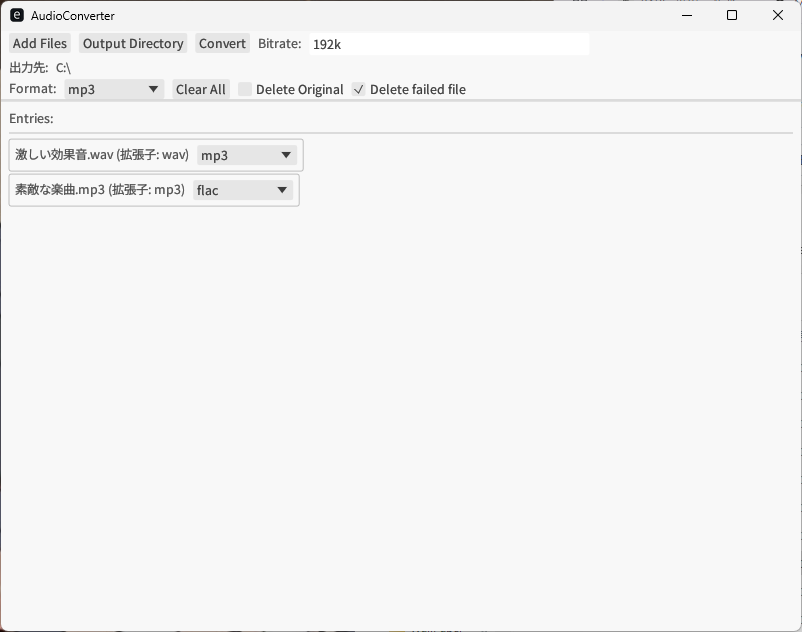

# AudioConverter
**Created by [Copiot](https://copilot.microsoft.com/)**

主な音声ファイルを変換します

対応拡張子
- mp3
- wav
- flac
- opus
- m4a

## UI
### ボタン
- Add Files
  音声を追加します
- Output Directory
  出力先のディレクトリ（フォルダ）を指定します
  すぐ下に表示されます
- Convert
  変換を開始します
- Clear All
  選択されたファイルをリストから全て削除します
  元のファイルは消えません
### トグル
- Format
  変換後の拡張子を指定します
  個別で指定することもできます
### チェックボックス
- Delete Original
  変換後、変換前のファイルを削除します
- Delete failed file
  変換に失敗した場合、失敗したファイルを削除します
  元のファイルは消えません
  （デフォルトでオンになっています）
## 入力
- Bitrate
  現在変更不可
## デバッグ
- Log
  `Alt+L`で処理のログを確認できます
  変換、出力が成功したかどうかが確認できます
